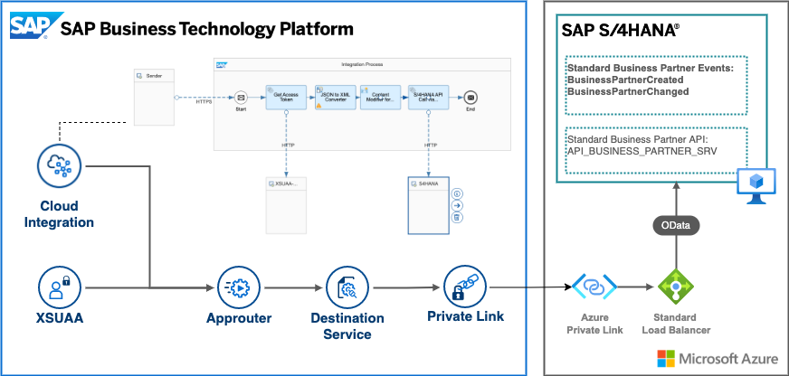

# SAP Private Link service use cases for SAP Cloud Integration and SAP Launchpad  

<!--- Register repository https://api.reuse.software/register, then add REUSE badge:

-->

## Description

## SAP Private Link service with SAP Cloud Integration for building diverse integration scenarios

The SAP Cloud Integration capability of SAP Integration Suite enables enterprises to connect different systems and applications in hybrid and cloud landscapes, that are developed and maintained on different technology stacks. These stacks, usually follow different security standards and requirements. 

With the help of the [SAP Private Link service](https://help.sap.com/docs/PRIVATE_LINK?locale=en-US), you can extend your hybrid integration scenarios to suit stricter security policies and communicate with your SAP S/4HANA on Microsoft Azure through private network connectivity. 

The main idea of this architecture is to use the Application Router as a proxy for the private connectivity between SAP S/4HANA and SAP Cloud Integration. The detailed configuration steps can follow [here](approuter-cloud-integration/).

>Please note that for the moment, we cannot use SAP Private Link service directly from SAP Cloud Integration; nevertheless, we can bridge this gap with help of SAP’s Application Router (approuter), which can play the role of a proxy between SAP Private Link service and SAP Cloud Integration, meanwhile product team is working to enable direct integration.

## SAP Private Link service for frontend applications accessible from SAP Launchpad Service 

SAP Launchpad service plays an important role to increase users’ productivity and efficiency by enabling organizations to establish a central point of access to SAP, custom-build, third-party applications, and extensions.  

The frontend extensions of your SAP S/4HANA system running on SAP BTP can now also benefit from the new SAP Private Link service by establishing private connectivity to your SAP backend systems.  

Like the above-mentioned scenario, the main idea of this architecture is to use the Application Router as a proxy for the private connectivity between SAP S/4HANA and frontend extensions running on SAP BTP. Detailed configuration steps can be found [here](approuter-launchpad/).

>Please note that for the moment, we cannot use SAP Private Link service directly from SAP Launchpad service; nevertheless, we can bridge this gap with help of SAP’s Application Router (approuter), which can play the role of a proxy between SAP Private Link service and SAP Launchpad service, meanwhile product team is working to enable direct integration.

>Please note that this scenario covers only the frontend extensions. The federated SAP S/4HANA content is out of scope.

## How to achieve this?  
 
[Application Router](https://help.sap.com/docs/BTP/65de2977205c403bbc107264b8eccf4b/01c5f9ba7d6847aaaf069d153b981b51.html?locale=en-US) is a package available in the public [npm repository](https://www.npmjs.com/package/@sap/approuter), usually used as a single-entry point to your applications. It can help dispatch incoming requests to other microservices, facilitate authentication & authorization, and finally integrate other SAP BTP services like the Destination service or the HTML5 Application Repository.  

These main capabilities of the Application Router with the latest release (as of today - 11.3.2) can help you establish the above-mentioned proxy role for Private Link.  

The detailed configuration of the Application Router you can find in usecase details.

## Known Issues
No known issues.

## How to obtain support
[Create an issue](https://github.com/SAP-samples/<repository-name>/issues) in this repository if you find a bug or have questions about the content.
 
For additional support, [ask a question in SAP Community](https://answers.sap.com/questions/ask.html).

## Contributing
If you wish to contribute code, offer fixes or improvements, please send a pull request. Due to legal reasons, contributors will be asked to accept a DCO when they create the first pull request to this project. This happens in an automated fashion during the submission process. SAP uses [the standard DCO text of the Linux Foundation](https://developercertificate.org/).

## License
Copyright (c) 2022 SAP SE or an SAP affiliate company. All rights reserved. This project is licensed under the Apache Software License, version 2.0 except as noted otherwise in the [LICENSE](LICENSE) file.
