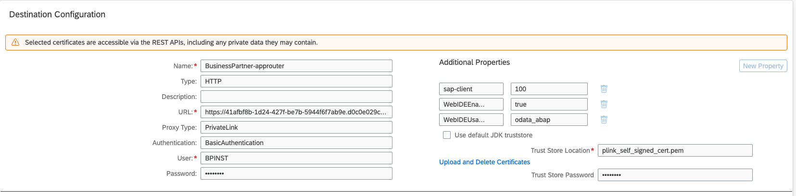
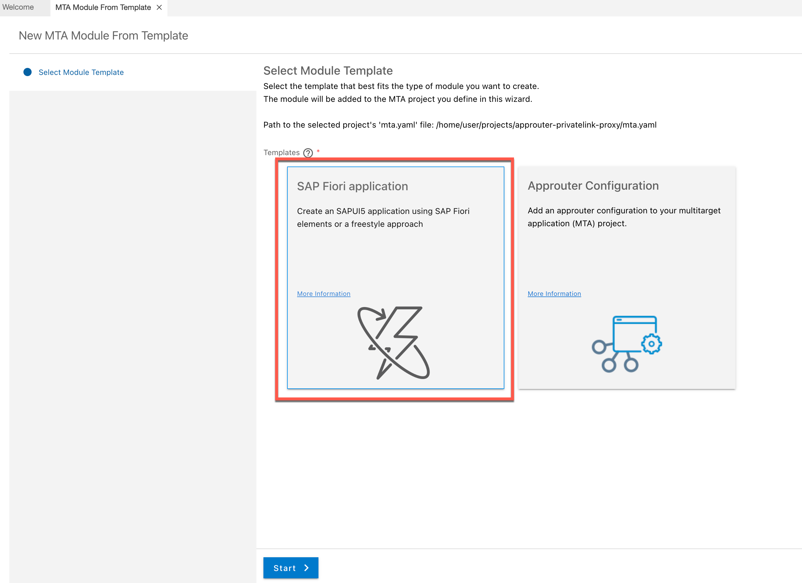
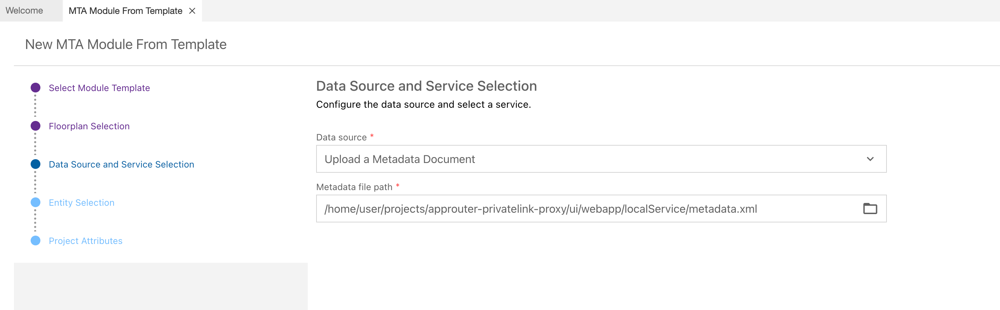
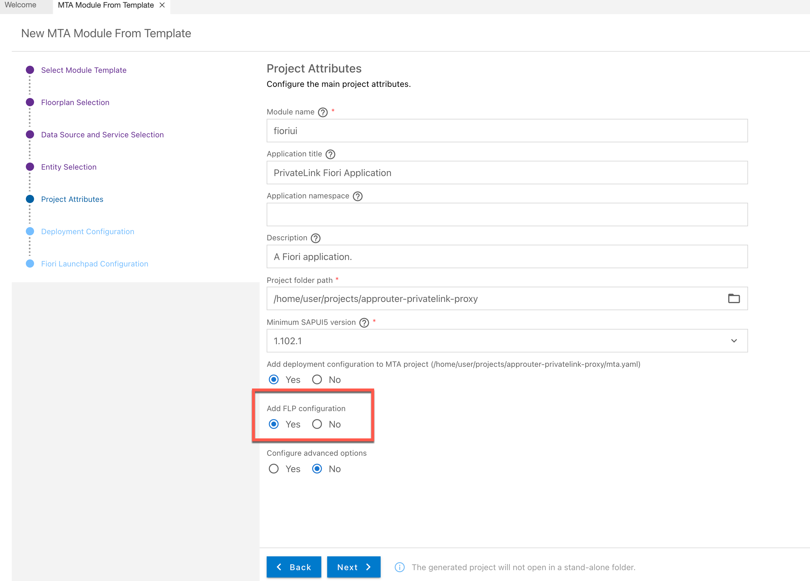
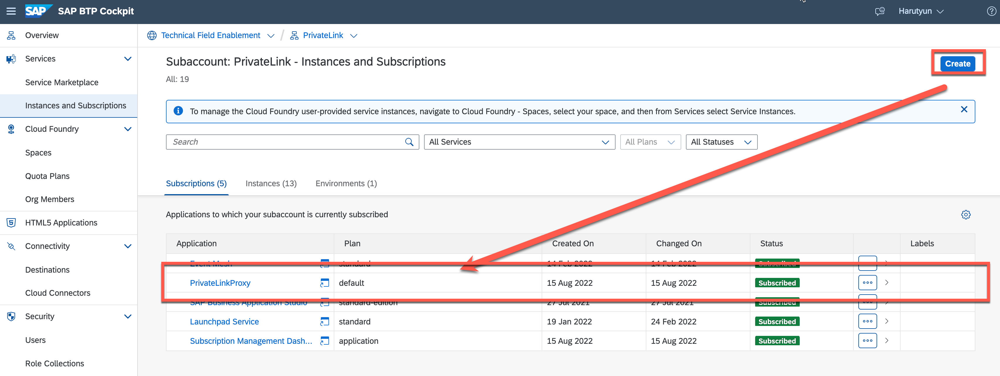
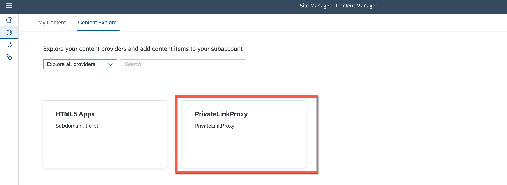
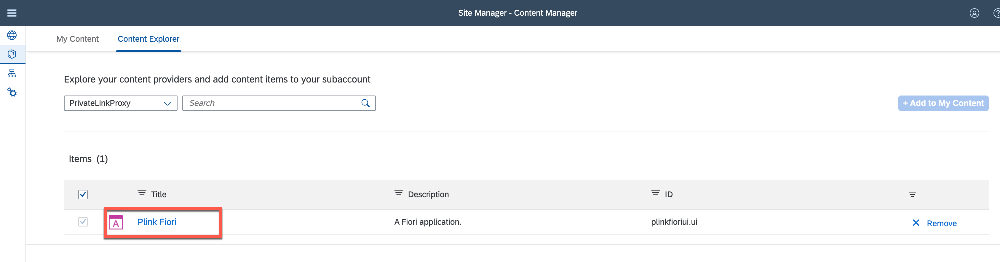
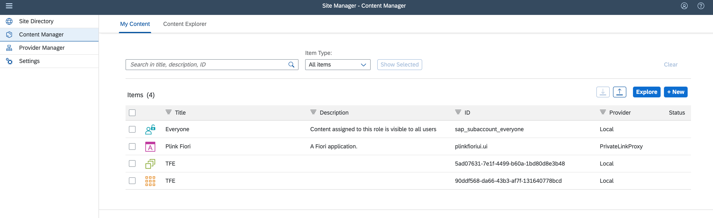
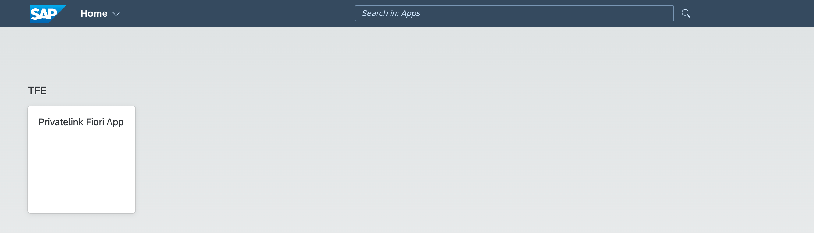

# SAP Private Link service for frontend applications accessible from SAP Launchpad Service

SAP Launchpad service plays an important role to increase users’ productivity and efficiency by enabling organizations to establish a central point of access to SAP, custom-build, third-party applications, and extensions.  

The frontend extensions of your SAP S/4HANA system running on SAP BTP can now also benefit from the new SAP Private Link service by establishing private connectivity to your SAP backend systems.  

>Please note that this scenario covers only the frontend extensions. The federated SAP S/4HANA content is out of scope.  

The main idea of this architecture is to use the Application Router as a proxy for the private connectivity between SAP S/4HANA and frontend extensions running on SAP BTP. The configuration steps you can find below.


## Configure and deploy Application Router 

You can configure and deploy the Application Router with the IDE of your choice, but with help of **SAP Business Application Studio (BAS)**, it is much simpler, since you can take advantage of the provided templates for your Application Router configuration. 

If you choose BAS, select **Standalone Approuter** as an option in the template wizard. 


The only configuration required in the Application Router is to define the route and the destination used for the SAP Private Link connectivity. This can be done in the xs-app.json file where BusinessPartner-approuter is the destination configured for SAP Private Link connectivity in the target SAP BTP subaccount (see destination configuration below).  

 
```json
{ 
  "authenticationMethod": "route", 
  "routes": [ 
    { 
        "source": "^/sap/(.*)$", 
        "target": "/sap/$1", 
        "destination": "BusinessPartner-approuter", 
        "authenticationType": "xsuaa", 
        "csrfProtection": false 
    } 
  ] 
} 
```




## Add Fiori frontend to application router connfiguration

Another benefit of using Business Application Studio is, that you can add a new Fiori application to your MTA project using the template wizard.



> Unfortunately for the moment it is not possible to load directly the **metadata** of OData service with Private Link Destination from Business Application Studio, nevertheless, you can upload the metadata manually and proceed with the wizard steps.



Please also add the **flp configuration**, so we can later register our application in the SAP Launchpad service.



## Expose the application as a content provider for the SAP Launchpad service

To expose our app with a **Standalone Application Router** as a Content Provider for SAP Launchpad service, a couple of further steps are required. 
First of all, we need to change the app settings to a multitenant application by using the saas-registry service. Then we can subscribe to the application and add the app to SAP Launchpad Service. Please follow the [help documentation](https://help.sap.com/docs/Portal_Service/ad4b9f0b14b0458cad9bd27bf435637d/8a25fddb747f4ba992969049de96f836.html?locale=en-US) or have a look at the provided [sample application](mta.yaml).

>Note: This step is required since we are not using the Managed Application Router

After adding the required configuration please deploy the app and subscribe to the multitenant application 



## Register the frontend application in the SAP Launchpad service

Go to Content Manager and look for "PrivateLinkProxy" as a provider (this will be available once you subscribe to the application in the previous step)



Select your Fiori application



Go to "My Content" and add the selected Fiori application to your **Group, Catalog & Role**



Launch the Launchpad, where you will find your Fiori application with SAP Private Link service connectivity



## Summary

Congratulations, you successfully registered your Fiori application with Standalone Application Router to SAP Launchpad with SAP Private Link service connectivity


