# Azure Blob Storage connectivity to SAP Cloud Integration with help of SAP Private Link service

The SAP Cloud Integration capability of SAP Integration Suite enables enterprises to connect different systems and applications in hybrid and cloud landscapes, that are developed and maintained on different technology stacks. These stacks, usually follow different security standards and requirements. 

With the help of the SAP Private Link service, you can extend your hybrid integration scenarios to suit stricter security policies and communicate with your workloads on Microsoft Azure through private network connectivity. 

The main idea of this architecture is to use the Application Router as a proxy for the private connectivity between Azure Blob Storage and SAP Cloud Integration. Detailed configuration steps you can find below.

>Please note that for the moment, we cannot use SAP Private Link service directly from SAP Cloud Integration; nevertheless, we can bridge this gap with help of SAP’s Application Router (approuter), which can play the role of a proxy between SAP Private Link service and SAP Cloud Integration, meanwhile product team is working to enable direct integration.

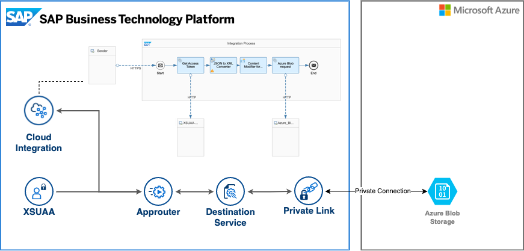


## Configure and deploy Application Router 

You can clone this repository and use the provided sample approuter by using the IDE of your choice.

Another approach is using **SAP Business Application Studio (BAS)**, where you can take advantage of the provided templates for your Application Router configuration.

If you choose BAS, select **Standalone Approuter** as an option in the template wizard. 

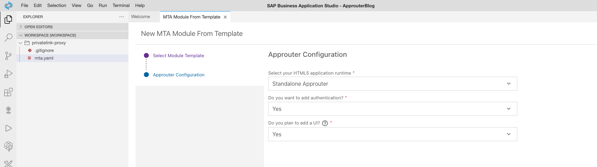

Define the route and the destination used for the SAP Private Link connectivity. This can be done in the xs-app.json file where **blob-approuter** is the destination configured for SAP Private Link connectivity in the target SAP BTP subaccount (see destination configuration below).  

>NOTE: Please change the **source** and **target** properties as required in your scenario (e.g. other path instead of /myfiles)

 
```json
{
  "authenticationMethod": "route",
  "routes": [
    {
        "source": "^/myfiles/(.*)$",
        "target": "/myfiles/$1",
        "destination": "blob-approuter",
        "authenticationType": "xsuaa",
        "csrfProtection": false
    }
  ]
}
```

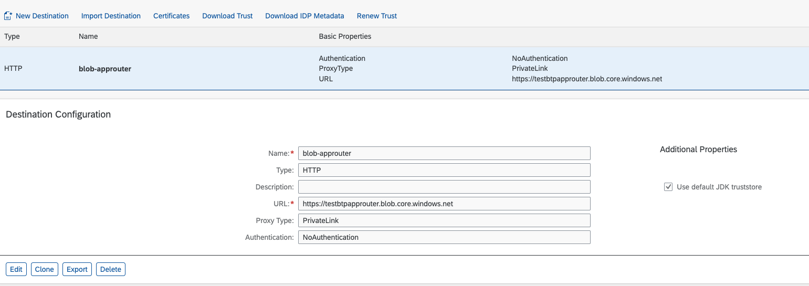


After setting up the route with destination and authentication, you can deploy the Application Router to your SAP BTP subaccount 
```json
e.g. by  mbt build and cf deploy privatelink-proxy.mtar 
```

Once the Application Router is up and running, it can be used by your integration flows to connect with the Azure Blob Storage. 

## Use the Application Router proxy in SAP Cloud Integration iFlows

All your standard integration patterns can stay the same, you need to add a couple of additional steps to use the approuter proxy with the private link connectivity to your Azure Blob Storage.

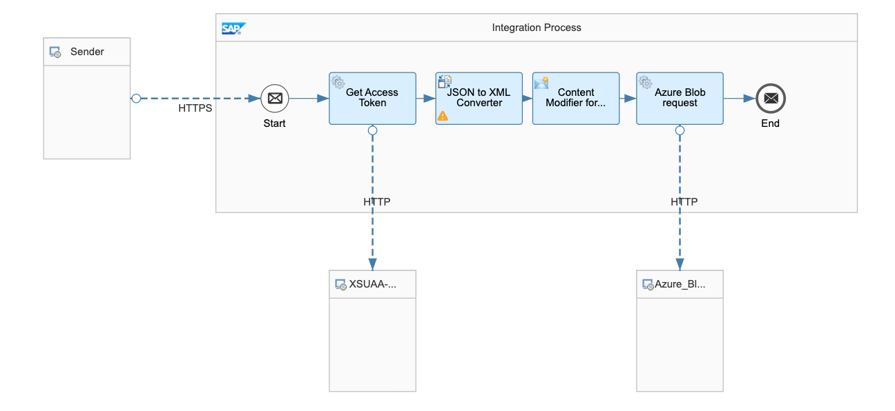

Following additional steps are required:

1.	Get the access token from the XSUAA component of approuter. Please maintain the *client_id* and *client_secret* of XSUAA component as **"User Credentials"** in the **Security Material** of SAP Cloud Integration

 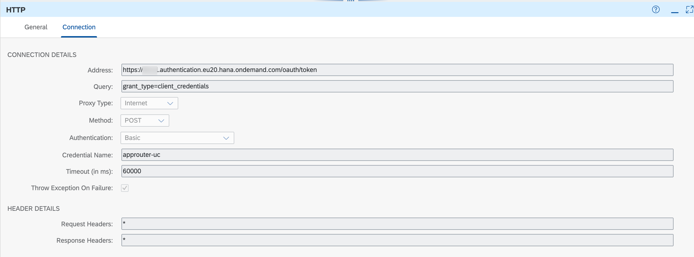

2.	Transform the response to XML (to add in a next step the custom header attribute)

  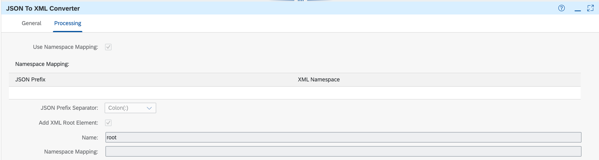

3.	Modify the content by adding the header “x-approuter-authorization” (required by approuter) from the Authorization header value

  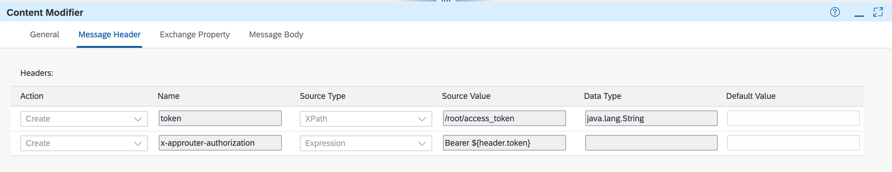

4.	Make the final call to the approuter, which will route the request to Azure Blob Storage via Private Link connectivity
  
  >The address correspondence to the Approuter URL 

  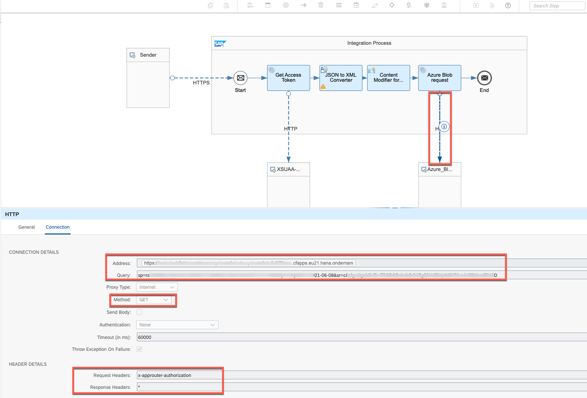

Having all these steps in place, you can deploy the integration flow and test it by calling your integration endpoint.

The example iFlow configuration you can get [here](iflow/PrivateLinkProxyAzureBlob.zip) and import to your SAP Cloud Integration tenant.

Go to your Cloud Integration cockpit and **import** the above-provided package.

  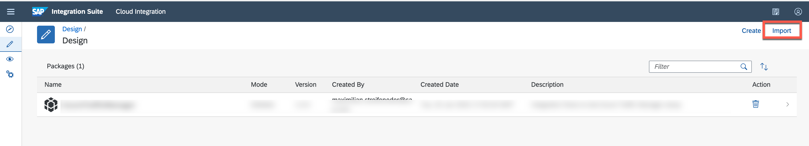

Open the imported package

  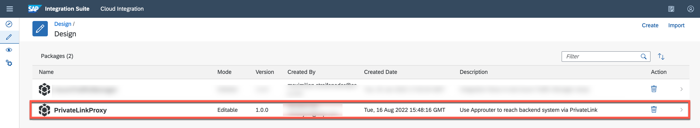

Open the integration flow

  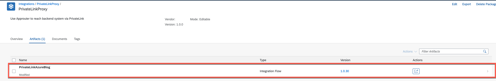

Configure the parameters based on your tenant

  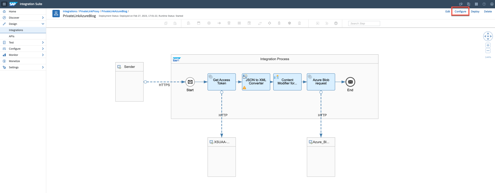

Provide the XSUAA URL and Credential name from Security Material

  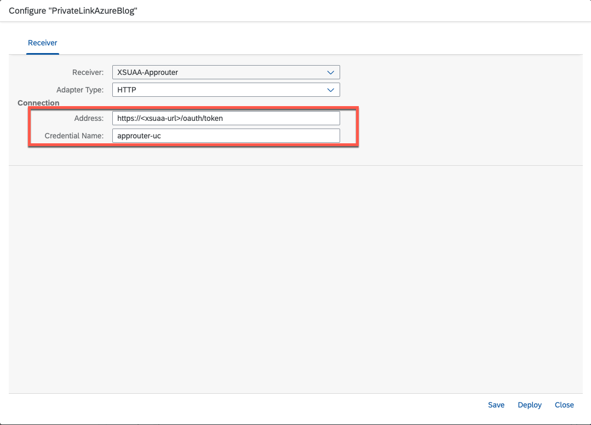

Provide the Approuter URL

  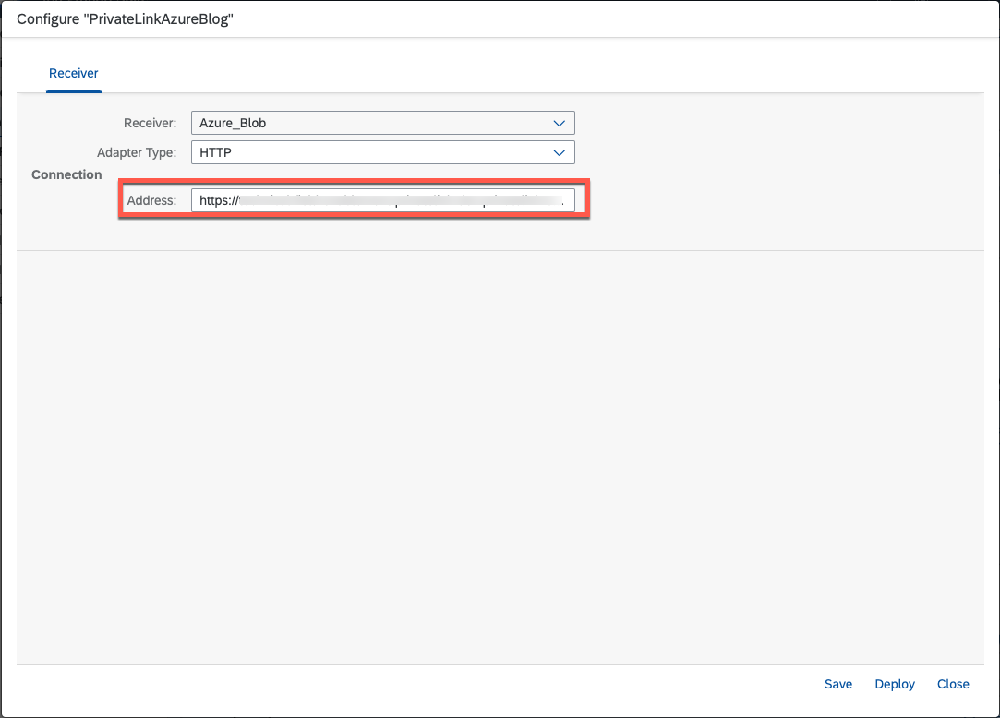

Deploy the iFlow

  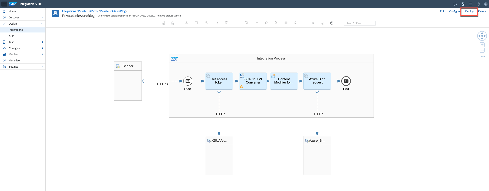

After deployment you can run your integration flow based on SAP Private Link connectivity.

## Summary

Congratulations, you successfully connected your hybrid integration flow with the SAP Private Link service


